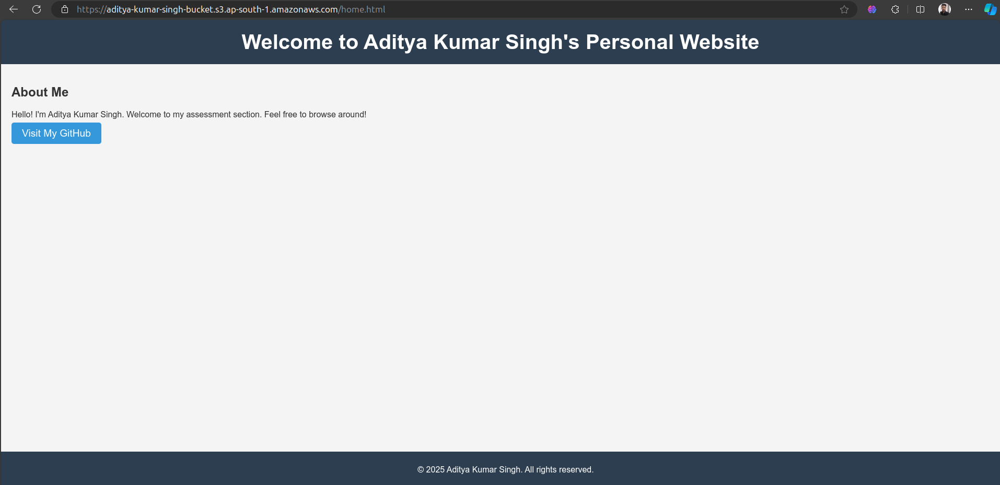
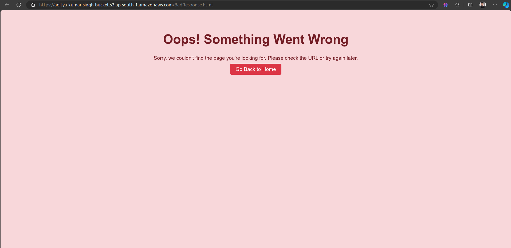

# AWS S3 Bucket Setup for Static Website Hosting

This Terraform configuration defines an Amazon S3 bucket for static website hosting. The setup includes creating an S3 bucket, uploading HTML files (for the home page and error page), configuring a public access policy, and setting the bucket as a static website.

## How to Use This Configuration

### Prerequisites:
1. Terraform must be installed on your local machine. You can download Terraform from [here](https://www.terraform.io/downloads).
2. An AWS account with the necessary permissions to create S3 buckets and apply policies.

### Steps to Apply:

1. **Clone the repository or copy the `main.tf` file** to your working directory.

2. **Initialize the Terraform configuration**:
   ```bash
   terraform init
   ```
3. **Review the Plan**:
   ```bash
   terraform plan
   ```
4. **Apply the Plan**:
   ```bash
   terraform apply
   ```   
5. **Sample Output**:
   
   